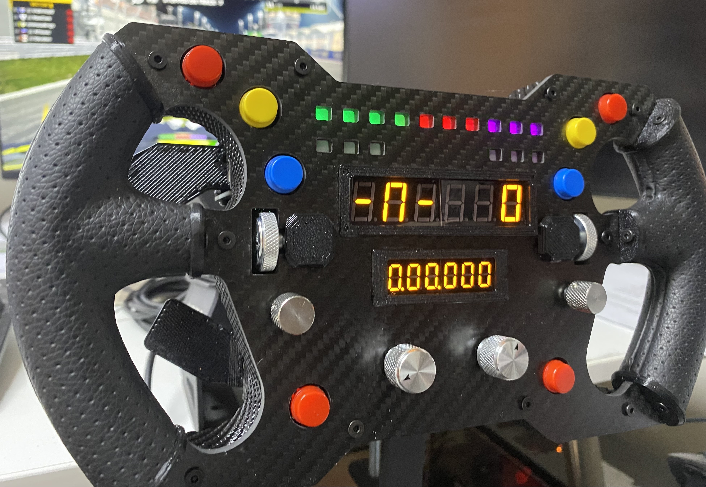

1 # The Open Source DIY Sim Racing Wheel Project

Racing using a self built wheel is very unique and satisfying experience.
Unfortunately, building a sim racing wheel from scratch is very challenging task and requires many different skills and tools.
The goal of this project is to make building sim racing wheels accessible to everyone.

{ align=left }

## Main features:

* `Simple for beginners`- The process of  building the wheel is well documented by an easy to follow step by step guide.
* `Affordable` - This project is using "off-the-shelf" , easy to source components.
This drives the cost down without compromising on functionality and quality.
* `DIY` - Easy to build, no need for special tools or skills. If you buy our kit you don't even need to have a 3D printer and soldering iron.
* `Open source` - All the resources are provided for free under open source license, including 3D models, code and even PCB files.
* `Community Driven ` - While this project is great for complete beginners, due to it's open source nature advanced users are welcome to make improvements, add-ons or adjustments and share them with the community. 

## Specifications:

- [x] 290mm diameter.
- [x] 2 X 6 Digit Segment displays
- [x] 8 Standalone Buttons
- [x] 2 X Rotary Encoders (With push button functionality)
- [x] 2 X Thumb Encoders  (With push button funcionality)
- [x] 2 X Funky (7 way)  Switches
- [x] 16 RGB Leds
- [x] 2 X Magnetic shifters
- [x] 2 X Clutches (with hall sensors)
- [x] SimHub Compatible
- [x] Compatible with 70mm Quick-Release systems

